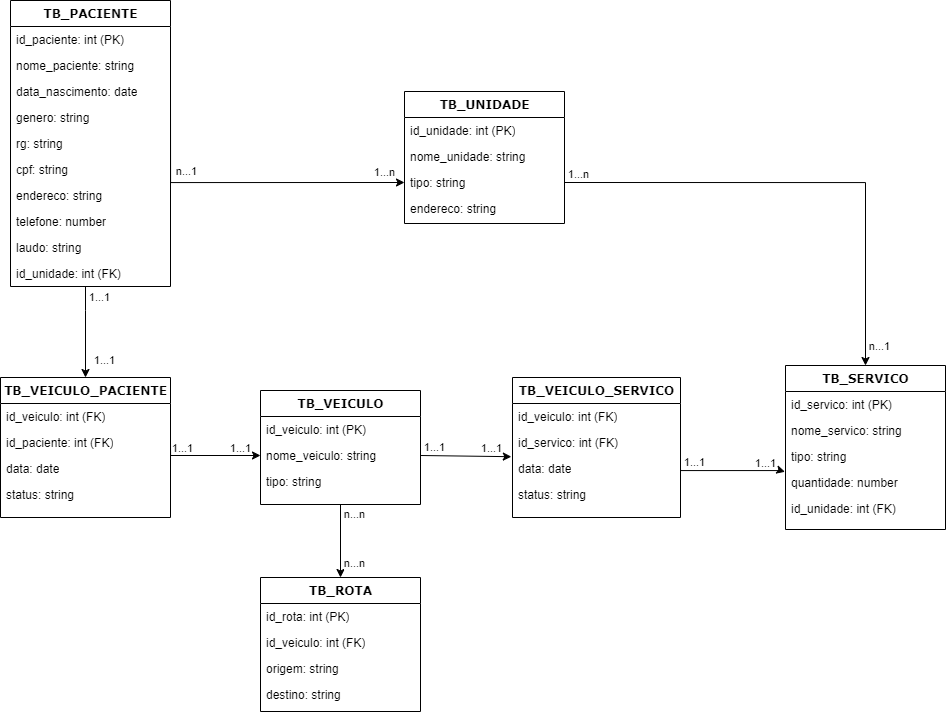
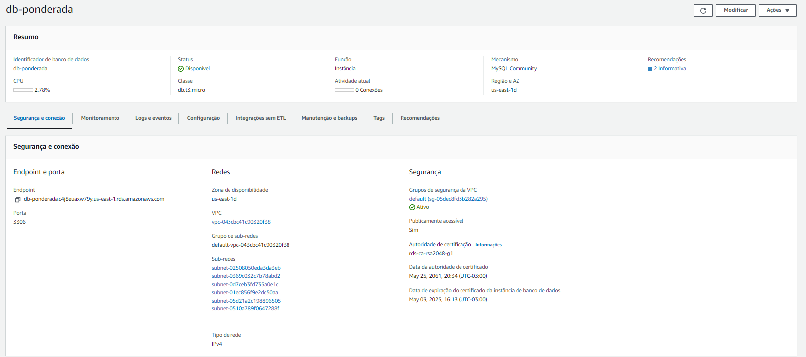
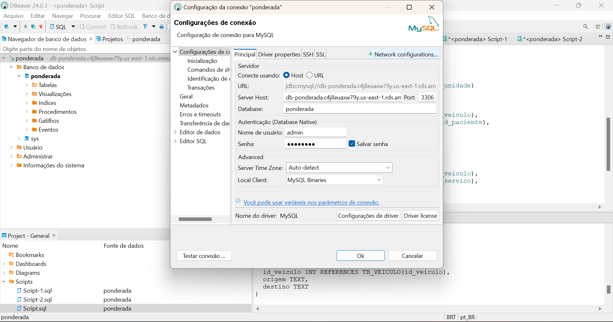
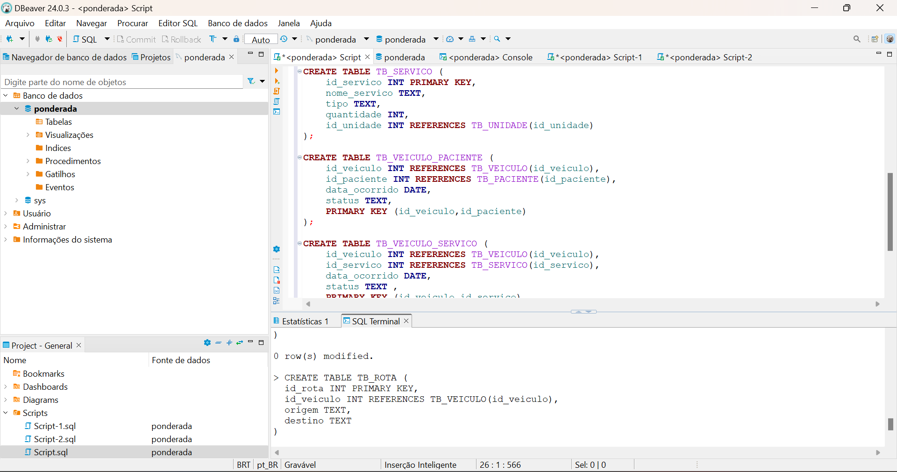
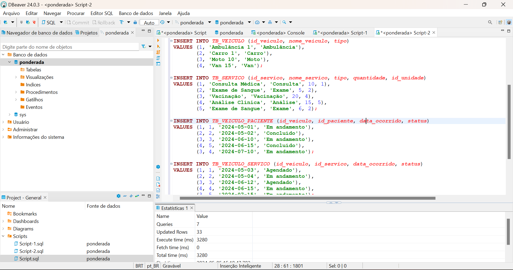

# Modelando dados e fazendo deploy em Nuvem

## Modelo lógico

O modelo lógico desenvolvido para o exercício inclui tabelas, como Paciente, Unidade, Veículo, Serviço, entre outras, que armazenam informações relevantes para o funcionamento do sistema. Nele é possível entender a organização e a inter-relação dos dados no banco de dados elaborado.

  

## Conexão com o RDS

Após criar o banco de dados no RDS é necessário realizar a conexão com o mesmo por meio do Endpoint e autenticação:

  

  

## Criando as tabelas

Com a conexão feita é possível criar as tabelas necessárias para a elaboração do modelo físico:

  

[Acesse o código de criação aqui](codigos/create_table.sql)

## Inserindo os dados

Após criar as respectivas tabelas, é necessário inserir os dados fictícios:

  

[Acesse o código de inserção aqui](codigos/insert_table.sql)

## Realizando a consulta

Com toda a criação e inserção de dados feita, é possível executar a consulta solicitada no enunciado:

"Calcule o número médio de pacientes transportados por veículo por mês"

[Acesse o código de consulta aqui](codigos/query.sql)

## Link do RDS

Endpoint: db-ponderada.c4j8euaxw79y.us-east-1.rds.amazonaws.com